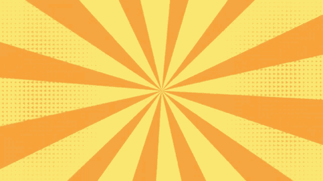

# 🎮 2048 Game

A fully functional implementation of the popular 2048 puzzle game built with **Next.js**, **React**, **TypeScript**, **RetroUI** and **Tailwind CSS**. This implementation follows functional programming principles and features a beautiful retro-styled UI.



## ✨ Features

### Core Gameplay
- ✅ **4x4 default board** with smooth gameplay
- ✅ **Keyboard controls** - Arrow Keys and WASD support
- ✅ **Touch controls** - Mobile-friendly on-screen buttons
- ✅ **Tile merging** - Combine tiles with same numbers
- ✅ **Random tile generation** - 2 or 4 appears after each move
- ✅ **Win/Lose detection** - Reach 2048 to win, game over when no moves left

### Advanced Features
- 🎨 **Configurable board sizes** - 3x3, 4x4, 5x5, 6x6
- 📊 **Score tracking** - Current score and best score
- 💾 **Persistent best score** - Saved in localStorage
- 🔄 **Game restart** - Start fresh anytime
- 🎭 **Beautiful animations** - Smooth tile transitions
- 📱 **Responsive design** - Works on desktop, tablet, and mobile

## 🚀 Getting Started

### Installation

1. Clone the repository:
```bash
git clone https://github.com/amanfangeria980/2048-game
cd 2048-game
```

2. Install dependencies:
```bash
npm install
# or
yarn install
```

3. Run the development server:
```bash
npm run dev
# or
yarn dev
```

4. Open [http://localhost:3000/play](http://localhost:3000/play) in your browser

## 🎯 How to Play

1. **Move tiles** using:
   - Arrow Keys (↑ ↓ ← →)
   - WASD keys
   - On-screen buttons (mobile)

2. **Merge tiles** - When two tiles with the same number touch, they merge into one with their sum

3. **Goal** - Reach the **2048** tile to win!

4. **Game Over** - No more moves available

5. **Choose board size** - Select 3×3 to 6×6 for different challenges

## 📁 Project Structure

```
2048-game/
├── app/
│   ├── hooks/
│   │   └── useGameLogic.ts      # Game state management
│   ├── utils/
│   │   └── boardUtils.ts        # Pure functional game logic
│   ├── play/
│   │   └── page.tsx             # Main game page
│   └── globals.css              # Global styles & animations
│
├── components/
│   ├── tile/
│   │   └── Tile.tsx             # Individual tile component
│   ├── game-box/
│   │   └── GameBox.tsx          # Game board grid
│   ├── scoreboard/
│   │   └── ScoreBoard.tsx       # Score display
│   ├── controls/
│   │   └── Controls.tsx         # Game controls
│   └── retroui/
│       ├── Button.tsx           # Retro button component
│       └── Text.tsx             # Retro text component
│
└── public/
    └── assets/
        └── images/              # images
        └── audio/               # Audio files
```

## 🧠 Implementation Details

### Key Functions

**boardUtils.ts** - Pure functional game logic:
- `initializeBoard(size)` - Create new board with random tiles
- `moveLeft/Right/Up/Down(board)` - Move and merge tiles
- `canMove(board)` - Check if moves are possible
- `hasWon(board)` - Check for 2048 tile
- `addRandomTile(board)` - Add new tile after move

**useGameLogic.ts** - React hook for state management:
- Game state (board, score, best score, status)
- Keyboard event handling
- Game restart and continue functionality
- LocalStorage integration

### Component Architecture

```
PlayPage
├── ScoreBoard (displays score & game status)
├── Controls (new game, board size, touch buttons)
└── GameBox (game board)
    ├── Grid Background
    ├── Tiles (animated)
    └── Game Over Overlay
```

## 🎨 Customization

### Board Sizes

Add/remove board sizes in `components/controls/Controls.tsx`:

```typescript
const boardSizes = [3, 4, 5, 6]; // Customize available sizes
```